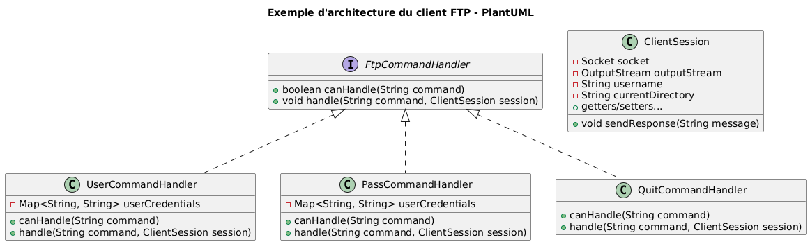

# TP1 - Serveur FTP

## Commandes implémentées

Dans la version actuelle du projet, notre serveur FTP implémente un certain nombre de commandes telles que :
- USER : pour le nom d'utilisateur,
- PASS : pour le mot de passe,
- QUIT : pour se déconnecter,
- SIZE : pour afficher la taille d'un fichier,
- SYST : pour afficher le type système,
- FEAT : pour afficher la liste des fonctions supportées en faisant une tabulation (permet l'autocomplétion),
- EPSV : pour entrer en mode passif étendu,
- LPSV : pour se connecter en mode passif prolongé,
- RETR : pour récupérer la copie d'un fichier,
- LIST : pour afficher les informations d'un fichier ou d'un répertoire spécifique, ou du répertoire courant ; équivalent de la commande `ls` ou `dir`,
- CWD : pour changer le répertoire de travail ; équivalent de la commande `cd` dans un terminal,

## Commandes manquantes

Notre serveur gère actuellement le téléchargement (RETR), mais pas l'upload de fichiers. Ainsi, il faudrait implémenter la commande `STOR` dans notre code.

La suppression d'un fichier peut aussi s'avérer utile, en implémentant la commande `DELE`.

Dans un système de fichier, il manque la création d'un répertoire avec la commande `MKD` mais aussi sa suppression avec `RMD`.

Je trouve qu'il peut aussi être intéressant d'avoir la commande `AUTH`, pour une avoir de l'authentification & un mécanisme de sécurité.

Enfin, la commande `ABOR`, pour annuler un transfert. Ainsi, si nous souhaitons mettre fin à une commande FTP qui est toujours en cours ou terminée, le serveur peut l'interrompre sans mettre fin à la connexion. 


# Autres améliorations possibles

Actuellement, l'ensemble du code est dans un fichier `Main.java`. Les principes de la POO ne sont pas réellement exploités.

Par conséquent, **le code est difficile à maintenir et à faire évoluer**. Le simple ajout d'une commande est assez complexe : ajout d'une méthode, rajouter une condition `else if` dans notre boucle principale...

Notre architecture peut donc être largement améliorée :
- Avoir une interface `FtpCommandHendler`, que chaque classe de commandes implémente.
- Des classes pour chaque commandes comme `UserCommandHandler`, `PassCommandHandler`, `QuitCommandHandler`, etc.
- Une classe `ClientSession` pour gérer notre session.




Nous pourrions avoir un code comme suit dans notre boucle principale :
```java
public static void main(String[] args) {
    // ...
    List<FtpCommandHandler> handlers = List.of(
        new UserCommandHandler(credentials),
        new PassCommandHandler(credentials),
        new RetrCommandHandler(),
        new QuitCommandHandler()
        // ...
    );

    for (FtpCommandHandler handler : handlers) {
        if (handler.canHandle(command)) {
            handler.handle(command, session);
            break;
        }
    }
    // ...
}
```

## Sources / outils

- https://fr.wikipedia.org/wiki/Liste_des_commandes_ftp
- https://www.solarwinds.com/serv-u/tutorials/quit-user-abor-acct-syst-xdel-ftp-command
- PlantUML
- ChatGPT
- etc
